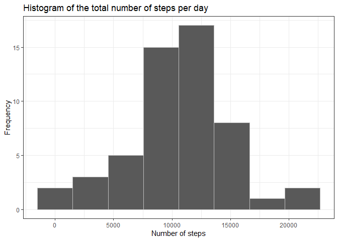
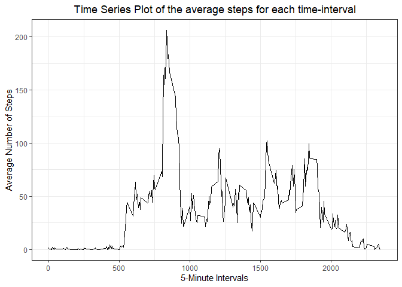
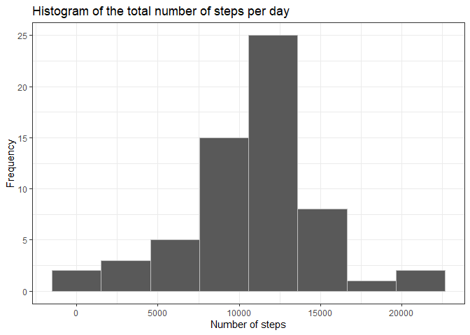
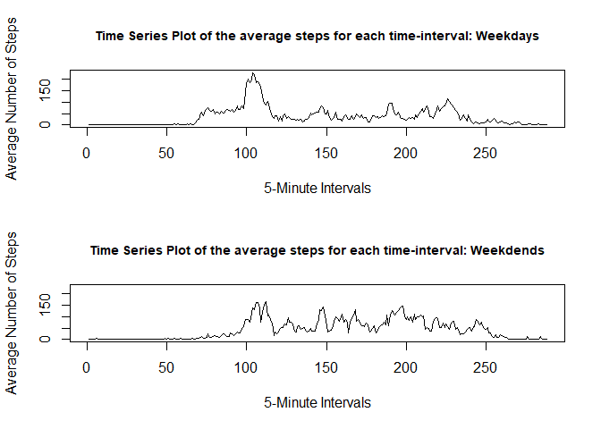

## Loading and preprocessing the data
First I am loading and pre-processing the data (named *"activity"*).

```r
# Read in the data
activity <- read.csv(unz("activity.zip", "activity.csv"), sep=",")
# Look at the data and classes
head(activity, n =10)
```

```
##    steps       date interval
## 1     NA 2012-10-01        0
## 2     NA 2012-10-01        5
## 3     NA 2012-10-01       10
## 4     NA 2012-10-01       15
## 5     NA 2012-10-01       20
## 6     NA 2012-10-01       25
## 7     NA 2012-10-01       30
## 8     NA 2012-10-01       35
## 9     NA 2012-10-01       40
## 10    NA 2012-10-01       45
```

```r
tail(activity, n =10)
```

```
##       steps       date interval
## 17559    NA 2012-11-30     2310
## 17560    NA 2012-11-30     2315
## 17561    NA 2012-11-30     2320
## 17562    NA 2012-11-30     2325
## 17563    NA 2012-11-30     2330
## 17564    NA 2012-11-30     2335
## 17565    NA 2012-11-30     2340
## 17566    NA 2012-11-30     2345
## 17567    NA 2012-11-30     2350
## 17568    NA 2012-11-30     2355
```

```r
str(activity)
```

```
## 'data.frame':	17568 obs. of  3 variables:
##  $ steps   : int  NA NA NA NA NA NA NA NA NA NA ...
##  $ date    : chr  "2012-10-01" "2012-10-01" "2012-10-01" "2012-10-01" ...
##  $ interval: int  0 5 10 15 20 25 30 35 40 45 ...
```

```r
# Transfer the date column into data class
activity$date <- as.Date(activity$date)
# Check
str(activity)
```

```
## 'data.frame':	17568 obs. of  3 variables:
##  $ steps   : int  NA NA NA NA NA NA NA NA NA NA ...
##  $ date    : Date, format: "2012-10-01" "2012-10-01" ...
##  $ interval: int  0 5 10 15 20 25 30 35 40 45 ...
```
## Exploratory Analysis
Look at the summary statistic for the dataset.

```r
summary(activity)
```

```
##      steps             date               interval     
##  Min.   :  0.00   Min.   :2012-10-01   Min.   :   0.0  
##  1st Qu.:  0.00   1st Qu.:2012-10-16   1st Qu.: 588.8  
##  Median :  0.00   Median :2012-10-31   Median :1177.5  
##  Mean   : 37.38   Mean   :2012-10-31   Mean   :1177.5  
##  3rd Qu.: 12.00   3rd Qu.:2012-11-15   3rd Qu.:1766.2  
##  Max.   :806.00   Max.   :2012-11-30   Max.   :2355.0  
##  NA's   :2304
```

## What is mean total number of steps taken per day?
1. Calculate the total number of steps taken per day.  

```r
FirstDay <- min(activity$date)
LastDay <- max(activity$date)

TotalSteps <- sum(activity$steps, na.rm = TRUE)
TotalSteps
```

```
## [1] 570608
```
The total number of steps within this time period (2012-10-01 till 2012-11-30) 
is 570608.

The total number of steps per day are:

```r
DailySteps <- tapply(activity$steps, activity$date, sum)
DailySteps
```

```
## 2012-10-01 2012-10-02 2012-10-03 2012-10-04 2012-10-05 2012-10-06 2012-10-07 
##         NA        126      11352      12116      13294      15420      11015 
## 2012-10-08 2012-10-09 2012-10-10 2012-10-11 2012-10-12 2012-10-13 2012-10-14 
##         NA      12811       9900      10304      17382      12426      15098 
## 2012-10-15 2012-10-16 2012-10-17 2012-10-18 2012-10-19 2012-10-20 2012-10-21 
##      10139      15084      13452      10056      11829      10395       8821 
## 2012-10-22 2012-10-23 2012-10-24 2012-10-25 2012-10-26 2012-10-27 2012-10-28 
##      13460       8918       8355       2492       6778      10119      11458 
## 2012-10-29 2012-10-30 2012-10-31 2012-11-01 2012-11-02 2012-11-03 2012-11-04 
##       5018       9819      15414         NA      10600      10571         NA 
## 2012-11-05 2012-11-06 2012-11-07 2012-11-08 2012-11-09 2012-11-10 2012-11-11 
##      10439       8334      12883       3219         NA         NA      12608 
## 2012-11-12 2012-11-13 2012-11-14 2012-11-15 2012-11-16 2012-11-17 2012-11-18 
##      10765       7336         NA         41       5441      14339      15110 
## 2012-11-19 2012-11-20 2012-11-21 2012-11-22 2012-11-23 2012-11-24 2012-11-25 
##       8841       4472      12787      20427      21194      14478      11834 
## 2012-11-26 2012-11-27 2012-11-28 2012-11-29 2012-11-30 
##      11162      13646      10183       7047         NA
```


2. Make a histogram of the total number of steps taken each day.

```r
g <- ggplot(as.data.frame(DailySteps), aes(DailySteps))+
    geom_histogram(col = "gray", 
                   bins = 8)+
    labs(title = "Histogram of the total number of steps per day",
         x = "Number of steps",
         y = "Frequency")+
    theme_bw()
suppressWarnings(print(g))
```

<!-- -->

3. Calculate and report the mean and median of the total number of steps taken per day.  
Mean:

```r
# Average step count for all days
AverageSteps <- mean(DailySteps, na.rm = TRUE)
AverageSteps
```

```
## [1] 10766.19
```
Median:

```r
# Median step count for all days
MedianSteps <- median(DailySteps, na.rm = TRUE)
MedianSteps
```

```
## [1] 10765
```
The average total step count within this time period (2012-10-01 till 2012-11-30) 
is 10766. The median is 10765.

## What is the average daily activity pattern?
1. Make a time series plot (i.e. type = "l") of the 5-minute interval (x-axis) 
and the average number of steps taken, averaged across all days (y-axis).


```r
# Calculate average steps per interval
mean_interval <- tapply(activity$steps, activity$interval, mean, na.rm = T)
# Plot the interval time series plot with ggplot2 function
g2 <- ggplot(as.data.frame(mean_interval), aes(unique(activity$interval), mean_interval))
g2 + geom_line()+
    labs(title = "Time Series Plot of the average steps for each time-interval",
         x = "5-Minute Intervals",
         y = "Average Number of Steps")+
    theme_bw()+
    theme(plot.title = element_text(hjust = 0.5))
```

<!-- -->

2. Which 5-minute interval, on average across all the days in the dataset, 
contains the maximum number of steps?

```r
which.max(mean_interval)
```

```
## 835 
## 104
```

```r
mean_interval[which.max(mean_interval)]
```

```
##      835 
## 206.1698
```
The 104. Interval namely, the following: 835 has the
most steps on average (206.17 steps).

## Imputing missing values
1. Calculate and report the total number of missing values in the dataset (i.e. the total number of rows with NAs).


```r
StepsNA <- sum(is.na(activity$steps))
DateNA <- sum(is.na(activity$date))
IntervalNA <- sum(is.na(activity$interval))
```
There are 2304 missing values in the "steps" variable, 0 in 
"dates", and 0 in "intervals".  

2. Devise a strategy for filling in all of the missing values in the dataset. 
The strategy does not need to be sophisticated. For example, you could use the 
mean/median for that day, or the mean for that 5-minute interval, etc.  
  
The missing values in the "steps" variable will be filled with the average 
(mean) of that interval.


3. Create a new dataset that is equal to the original dataset but with the 
missing data filled in.


```r
activityFilled <- activity
for (i in unique(activityFilled$interval)) {
        activityFilled$steps[is.na(activityFilled$steps) & activityFilled$interval == i] <- round(mean(activityFilled$steps[activityFilled$interval == i], na.rm = T), 2)
}
```

4. Make a histogram of the total number of steps taken each day and calculate 
and report the mean and median total number of steps taken per day. Do these 
values differ from the estimates from the first part of the assignment? What 
is the impact of imputing missing data on the estimates of the total daily 
number of steps?


```r
DailyStepsFilled <- tapply(activityFilled$steps, activityFilled$date, sum)
DailyStepsFilled
```

```
## 2012-10-01 2012-10-02 2012-10-03 2012-10-04 2012-10-05 2012-10-06 2012-10-07 
##   10766.13     126.00   11352.00   12116.00   13294.00   15420.00   11015.00 
## 2012-10-08 2012-10-09 2012-10-10 2012-10-11 2012-10-12 2012-10-13 2012-10-14 
##   10766.13   12811.00    9900.00   10304.00   17382.00   12426.00   15098.00 
## 2012-10-15 2012-10-16 2012-10-17 2012-10-18 2012-10-19 2012-10-20 2012-10-21 
##   10139.00   15084.00   13452.00   10056.00   11829.00   10395.00    8821.00 
## 2012-10-22 2012-10-23 2012-10-24 2012-10-25 2012-10-26 2012-10-27 2012-10-28 
##   13460.00    8918.00    8355.00    2492.00    6778.00   10119.00   11458.00 
## 2012-10-29 2012-10-30 2012-10-31 2012-11-01 2012-11-02 2012-11-03 2012-11-04 
##    5018.00    9819.00   15414.00   10766.13   10600.00   10571.00   10766.13 
## 2012-11-05 2012-11-06 2012-11-07 2012-11-08 2012-11-09 2012-11-10 2012-11-11 
##   10439.00    8334.00   12883.00    3219.00   10766.13   10766.13   12608.00 
## 2012-11-12 2012-11-13 2012-11-14 2012-11-15 2012-11-16 2012-11-17 2012-11-18 
##   10765.00    7336.00   10766.13      41.00    5441.00   14339.00   15110.00 
## 2012-11-19 2012-11-20 2012-11-21 2012-11-22 2012-11-23 2012-11-24 2012-11-25 
##    8841.00    4472.00   12787.00   20427.00   21194.00   14478.00   11834.00 
## 2012-11-26 2012-11-27 2012-11-28 2012-11-29 2012-11-30 
##   11162.00   13646.00   10183.00    7047.00   10766.13
```

```r
ggplot(as.data.frame(DailyStepsFilled), aes(DailyStepsFilled))+
    geom_histogram(col = "gray", 
                   bins = 8)+
    labs(title = "Histogram of the total number of steps per day",
         x = "Number of steps",
         y = "Frequency")+
    theme_bw()
```

<!-- -->


```r
# Average step count for all days (Filled data)
AverageStepFilled <- mean(DailyStepsFilled)
AverageSteps - AverageStepFilled
```

```
## [1] 0.007695639
```

```r
# Median step count for all days (Filled data)
MedianStepsFilled <- median(DailyStepsFilled)
MedianSteps - MedianStepsFilled
```

```
## [1] -1.13
```
**Conclusion:** The differences between the mean and median values for the daily
steps are really small when using the average interval value as filler for the 
NAs.

## Are there differences in activity patterns between weekdays and weekends?
1. Create a new factor variable in the dataset with two levels – “weekday” and 
“weekend” indicating whether a given date is a weekday or weekend day.


```r
activityFilled$Weekday <- as.POSIXlt(activityFilled$date)
activityFilled$Weekday <- weekdays(activityFilled$Weekday) == "Samstag" | weekdays(activityFilled$Weekday) == "Sonntag"
activityFilled$Weekday <- factor(activityFilled$Weekday, levels = c(F, T), labels = c("weekday", "weekend"))
table(activityFilled$Weekday)
```

```
## 
## weekday weekend 
##   12960    4608
```

2. Make a panel plot containing a time series plot (i.e. type = "l") of the 
5-minute interval (x-axis) and the average number of steps taken, averaged 
across all weekday days or weekend days (y-axis).


```r
# Calculate average steps per interval
mean_steps_weekday <- tapply(activityFilled$steps[activityFilled$Weekday == "weekday"], activityFilled$interval[activityFilled$Weekday == "weekday"], mean)

mean_steps_weekend <- tapply(activityFilled$steps[activityFilled$Weekday == "weekend"], activityFilled$interval[activityFilled$Weekday == "weekend"], mean)

# Plot the interval time series plot with base function
par(mfrow = c(2,1))
plot(mean_steps_weekday, 
     type = "l", 
     main = "Time Series Plot of the average steps for each time-interval: Weekdays",
     cex.main = .9,
     xlab = "5-Minute Intervals",
     ylab = "Average Number of Steps",
     ylim = c(0, max(mean_steps_weekday)))

plot(mean_steps_weekend, 
     type = "l", 
     main = "Time Series Plot of the average steps for each time-interval: Weekdends",
     cex.main = .9,
     xlab = "5-Minute Intervals",
     ylab = "Average Number of Steps",
     ylim = c(0, max(mean_steps_weekday)))
```

<!-- -->

```r
# Reset
par(mfrow = c(1,1))
```
